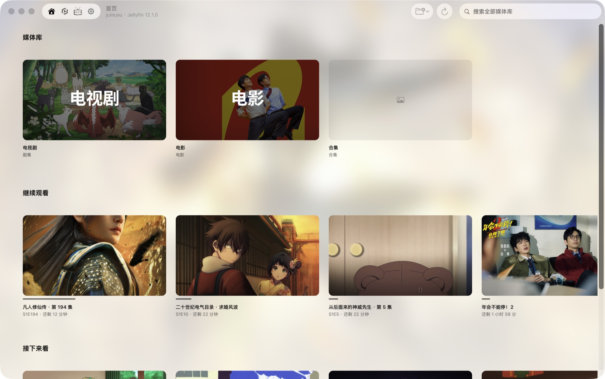
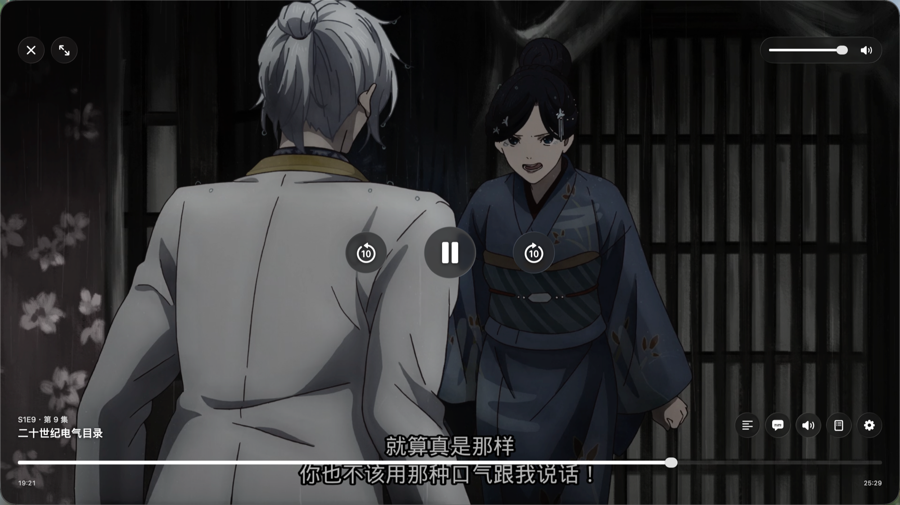

# OcPlayer · 橘猫播放器

<p align="center">
  
</p>

为 Jellyfin / Emby 打造的原生播放器,SwiftUI 双端(macOS 为主,iOS / iPadOS 同源)。播放内核是 Rust 写的 [Erika](https://github.com/AimesSoft/Erika)(内置 FFmpeg 解码 + libass 字幕渲染),弹幕接入弹弹play,另集成 Bangumi 追番与 MoviePilot 找片 / 下载 / 订阅。

<p align="center">
  
  
</p>

## 功能

- **媒体库** —— 自动识别 Jellyfin / Emby,多台服务器记住并可一键切换;库内排序、观看状态筛选与全库搜索;首页继续观看 / 接下来看 / 最近添加;详情页带完整媒体信息(分辨率、编码、码率,音轨与字幕逐轨列出)与海报氛围背景
- **播放** —— 硬解,HDR / 杜比视界按屏幕能力输出;倍速、音轨与字幕切换、外挂字幕、章节跳转、续播、自动连播;进度上报服务器,换设备接着看;片头片尾自动识别 + 悬浮「跳过」按钮(社区标注 / 弹幕报点 / 章节等多来源互补);原生液态玻璃 HUD,macOS 支持键盘快捷键
- **弹幕** —— 开箱即用:内置公共网关,连上就能用;没匹配上可手动搜索选集、调时间偏移,不透明度 / 显示区域 / 类型随时调
- **Bangumi 追番** —— 登录后同步收藏与在看进度、浏览每日放送日历;一集看完自动标记
- **MoviePilot 找片** —— 按标题搜站点资源、发起下载、管理订阅,下载完自动进媒体库
- **本地播放** —— ⌘O 打开本地文件或直连链接

Bangumi / MoviePilot 不用可在设置里停用,入口会全部隐藏。

## 系统要求

- macOS 26 及以上(Apple Silicon)
- iOS 26 及以上(iPhone / iPad)
- 服务器:Jellyfin 10.x / 12.x、Emby 4.x

## 下载

预编译版本见 [Releases](../../releases),各附 SHA256 校验文件:

- **macOS**:`OcPlayer-<版本>-macOS-arm64.dmg`,打开把 App 拖进「应用程序」
- **iOS / iPadOS**:`OcPlayer-<版本>-ios-unsigned.ipa`,未签名,用 [AltStore](https://altstore.io/) / [Sideloadly](https://sideloadly.io/) / TrollStore 等工具重签安装

> 产物未经 Apple 公证。macOS 首次打开若遇 Gatekeeper 提示,右键点 App 选「打开」即可;iOS 的签名与证书问题请参考所选工具的说明。

## 快速上手

1. **连接服务器**:首次启动输入 Jellyfin / Emby 的地址与账号密码(Jellyfin 也可用 Quick Connect;Emby 只有账号密码)。多台服务器都会记住,可在设置里切换或指定启动默认。
2. **开始播放**:点海报直接看。看到一半退出,下次从「继续观看」接着放。
3. **弹幕**:无需配置,播放时自动匹配;没对上就在播放器里手动搜索、调偏移。想自建网关见 [Docs/DEVELOPMENT.md](Docs/DEVELOPMENT.md)。
4. **追番 / 找片(可选)**:设置里登录 Bangumi、填入 MoviePilot 地址即可。

## 遇到问题?

先到「设置 → 维护 → 导出诊断包…」导出一个 `.txt`(含版本、设备与全部日志),报障时附上;需要更细的记录可在同一页打开「详细日志」。排查思路见 [Docs/TROUBLESHOOTING.md](Docs/TROUBLESHOOTING.md)。

## 从源码构建

需要 Xcode 26+ 与 macOS 26 SDK(Apple Silicon):

```bash
Scripts/bootstrap.sh      # 可选:生成本地 Secrets.xcconfig 模板(不覆盖已有文件)
Scripts/fetch-erika.sh    # 拉取播放内核 Erika(约 750MB,不入库)
Scripts/build-macos.sh    # 构建 macOS Debug;加 release 参数构建 Release
```

iOS 用 `Scripts/package-ios.sh` 打包(版本号从 `Config/App.xcconfig` 读取),或直接 `xcodebuild -scheme OcPlayer-iOS`。包结构、测试约定、内核钉点、CI 门禁等开发信息见 [Docs/DEVELOPMENT.md](Docs/DEVELOPMENT.md)。

## 文档

- 更新日志:[CHANGELOG.md](CHANGELOG.md)
- 排障手册:[Docs/TROUBLESHOOTING.md](Docs/TROUBLESHOOTING.md)
- 日志与诊断:[Docs/LOGGING.md](Docs/LOGGING.md)
- 开发者文档:[Docs/DEVELOPMENT.md](Docs/DEVELOPMENT.md)

## 许可证

本项目源代码以 [GPL-3.0](LICENSE) 发布。发布产物聚合的第三方许可见应用内「设置 → 关于」;FFmpeg、libass 等 LGPL 组件满足 notices 与可重链要求。

## 致谢

- [Erika](https://github.com/AimesSoft/Erika) —— Rust 播放内核(FFmpeg / libass)
- [DanmakuKit](https://github.com/qyz777/DanmakuKit)(vendored 为 DanmakuRenderKit)—— 弹幕渲染
- [弹弹play](https://www.dandanplay.com/) —— 弹幕数据
- [Bangumi](https://bgm.tv/) / [MoviePilot](https://github.com/jxxghp/MoviePilot) —— 追番与找片
- [Jellyfin](https://jellyfin.org/) / [Emby](https://emby.media/) / [jellyfin-sdk-swift](https://github.com/jellyfin/jellyfin-sdk-swift)
- [GRDB.swift](https://github.com/groue/GRDB.swift) / [Get](https://github.com/kean/Get) / [AniSkip](https://api.aniskip.com/) / [AniList](https://anilist.co/)

完整清单见应用内「设置 → 关于 → 开源许可证」。
